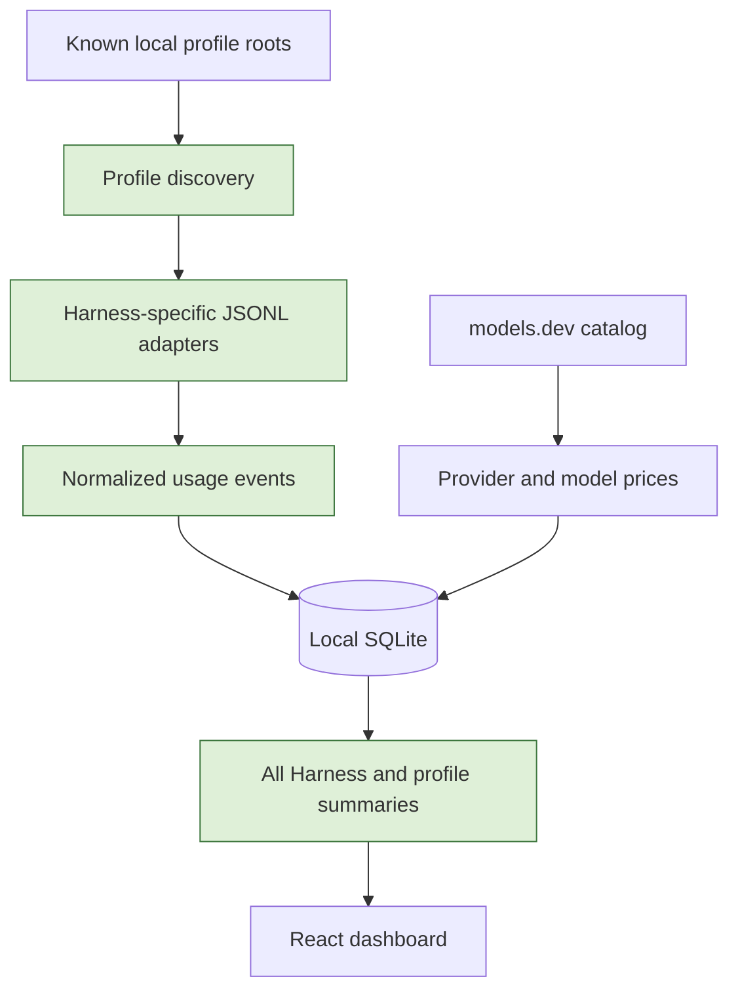

# Plan: multi-harness usage tracking

Status: implemented

## Goal

NerfTrack will import local usage summaries from Codex, Claude Code profiles, OMP, Copilot, and Kiro. The dashboard will show an All Harness total and a profile-level breakdown without storing prompts, credentials, account identifiers, or local paths. Devin remains visible as unavailable until a local usage source exists.

## Flow

## Scope

### May modify

- `src-tauri/src/{collector,lib,models,parser,pricing,storage}.rs`
- `src/{App,domain}.ts(x)`, `src/components/`, `src/lib/{commands,fixtures}.ts`, `src/styles.css`, `src/i18n.tsx`
- `docs/ARCHITECTURE.md`, `docs/CALCULATION.md`, this plan

### Must not modify

- `src-tauri/src/discovery.rs`, updater and release code
- dependency manifests and CI workflows
- existing untracked `AGENTS.md` and `.serena/`

## Constraints

- Use adapter-specific source paths. Do not recursively import arbitrary JSONL below a configuration directory.
- Store only normalized aggregate usage fields and a non-reversible profile identifier.
- Models.dev prices are API-equivalent estimates. Reported harness costs remain separate.
- Do not combine quota percentages or reset times across harnesses.

## Verification

1. Synthetic Codex, Claude, OMP, and Copilot records import with separate profile IDs and no fingerprint collision.
2. Provider-specific models.dev prices include cache-read and cache-write tokens.
3. The frontend shows All Harness totals and can select a single profile.

## Risks and rollback

- Incorrect parser mapping can inflate totals. Unknown records stay unpriced and adapters use strict paths.
- Rollback is a code revert. Existing rows migrate to the `codex-default` profile.

## Verification result

- Rust unit tests, including synthetic Codex, Claude, OMP, Copilot, and Kiro parser records, pass.
- Rust formatting and Clippy pass with warnings denied.
- Frontend tests are present but not run because `npm ci` fails while downloading packages with `EBADF` in this environment.
